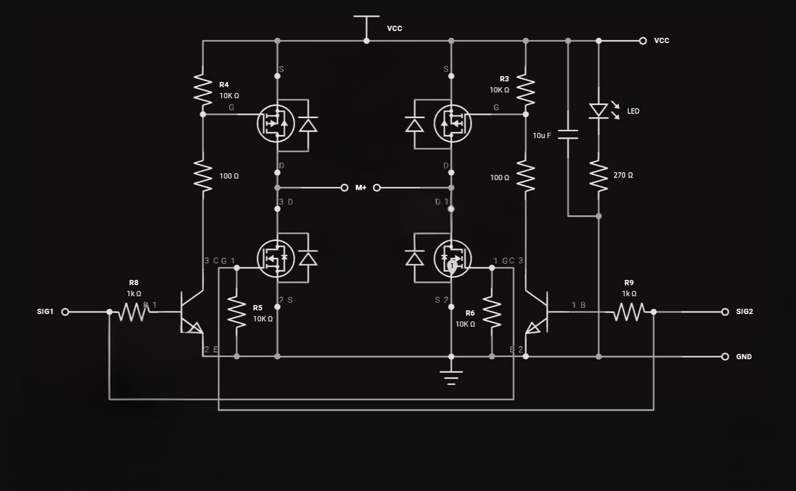
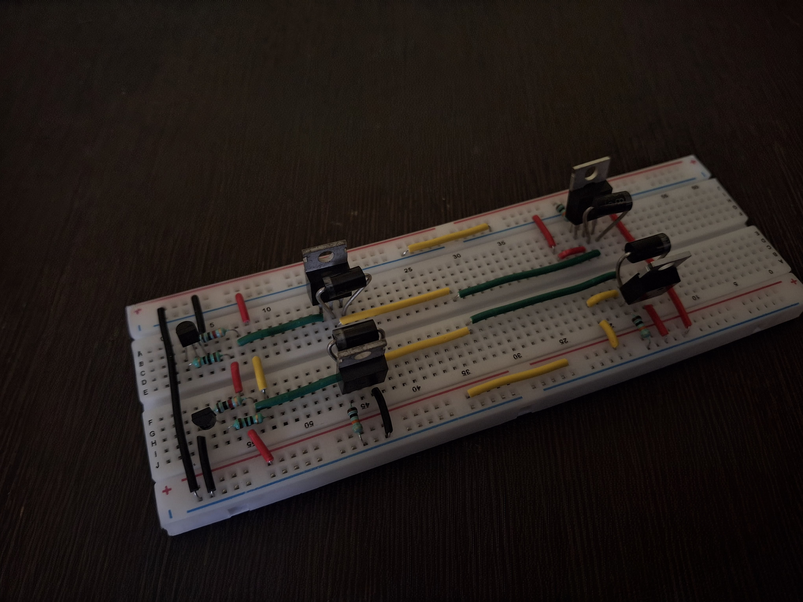
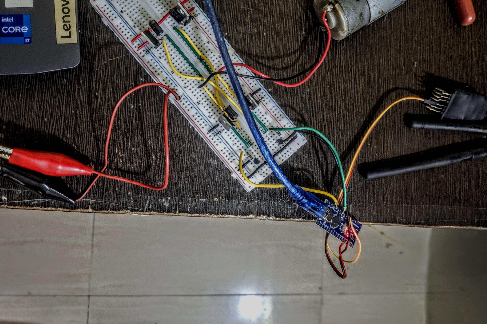

# BrushedESC Project – Custom H-Bridge ESC

## 🔧 Why an H-Bridge?
A brushed DC motor requires **bidirectional control** (forward & reverse).  
Directly powering the motor only spins it in one direction.  
The **H-Bridge** circuit solves this by allowing current to flow in **both directions**, enabling:  
- Forward rotation  
- Reverse rotation  
- Speed control (via PWM)  
- Motor braking  

---

## Custom H-Bridge Design
Instead of using a motor driver IC (like L293D or BTS7960), we built a **discrete H-Bridge** for learning and flexibility.  

### Components Used
- **2× N-Channel MOSFET** → IRFZ44N  
- **2× P-Channel MOSFET** → IRF9540  
- **2× NPN Transistor** → BC547 (for gate driving of P-MOS)  
- **4× Diodes** → Flyback protection (handles inductive kickback)  
- **4× 10kΩ Resistors** → Pull-downs / pull-ups for MOSFET stability  
- **2× 10Ω Resistors** → Gate current limiting  
- Breadboard, motor, Arduino/ATTiny for testing  

### Working Principle
- N-channel MOSFETs handle **low-side switching**  
- P-channel MOSFETs handle **high-side switching**  
- BC547 transistors invert and shift logic levels to drive the P-channel MOSFETs correctly  
- Diodes protect against voltage spikes generated by the motor  
- Resistors stabilize gate inputs and prevent unwanted switching  

---

##  Circuit Schematic
Bidirectional H-Bridge for brushed DC motor.  

---

## Breadboard Implementation
Practical build of the H-Bridge with MOSFETs, resistors, and diodes.  

---

## Brushed Motor + ESC Setup
Testing setup with Arduino/ATTiny connected to H-Bridge and motor.  

---

## 📌 Pinouts

### ATTiny (Single Channel ESC)
- **OUT1** → Motor terminal 1  
- **OUT2** → Motor terminal 2  
- **IN** → PWM signal input (from RC receiver)  
- **GND** → Ground  
- **VCC** → Motor power supply  

### Arduino Nano (Dual Channel ESC)
- **OUT1A (D3)** → Motor A terminal 1  
- **OUT2A (D5)** → Motor A terminal 2  
- **INA (D2)** → PWM input for Motor A  
- **OUT1B (D6)** → Motor B terminal 1  
- **OUT2B (D9)** → Motor B terminal 2  
- **INB (D4)** → PWM input for Motor B  

---

## 💻 Firmware

### ATTiny – Single Channel
File: `attiny.ino`  
Reads **one PWM signal** and controls a single motor.  

### Arduino Nano – Dual Channel
File: `atmega.ino`  
Reads **two PWM signals** and controls two motors independently.  

---

## 📖 How it Works
1. RC receiver sends **PWM input (1000–2000 µs)**  
2. ATTiny/Arduino measures the pulse width using **Pin Change Interrupts**  
3. Pulse width is compared to the **middle point (1500 µs)**  
   - Above 1500 → Motor spins forward  
   - Below 1500 → Motor spins backward  
4. PWM duty cycle is mapped (0–255) → sets motor speed  

---

## 📝 Notes
- Breadboard version is for testing → final design should move to PCB  
- Use **low Rds(on) MOSFETs** for better efficiency  
- For higher current, consider **driver ICs** like DRV8873 or BTS7960  

---

## 📂 Repository Files
- `attiny.ino` → ATTiny single channel ESC code  
- `atmega.ino` → Arduino Nano dual channel ESC code  
- `circuit_schematic.jpg` → H-Bridge schematic  
- `hbridge_breadboard.jpg` → Breadboard H-Bridge  
- `brushed_motor_esc.jpg` → Motor + ESC setup  

---

## 📜 License
MIT License – Free to use and modify  
